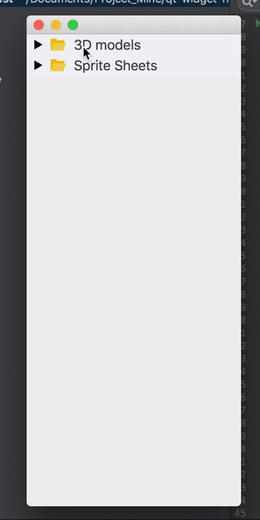

# [PyQt5] Hierarchy Panel Widget





```python
from TModel import HierarchicalModel
from TWidget import HierarchyPanel
from PyQt5.QtWidgets import QApplication

import sys

if __name__ == '__main__':
    app = QApplication(sys.argv)

    tree = HierarchicalModel()
    tree.add(0, name="root")\
        .add(1, 0, name="3D models", tip="you can set tooltip text\nby passing tip value of item")\
            .add(2, 1, name="Weapons")\
                .add(3, 2, name="Guns")\
                .add(4, 2, name="Melees")\
                .add(5, 2, name="Bombs")\
            .add(24, 1, name="Furnitures")\
            .add(25, 1, name="Instruments")\
            .add(26, 1, name="Zombies")\
            .add(6, 1, name="Vehicles")\
                .add(7, 6, name="Boats")\
                .add(8, 6, name="Bikes")\
            .add(9, 1, name="Trees")\
        .add(10, 0, name="Sprite Sheets")\
            .add(11, 10, name="Characters")\
            .add(12, 10, name="Buildings")\
            .add(13, 10, name="Map-Tiles")\
            .add(14, 10, name="Buttons")\
            .add(15, 10, name="Obstacles")\
            .add(16, 10, name="Magics")\
            .add(17, 10, name="Bullets&Rockets")\
            .add(18, 10, name="Lights")\
            .add(19, 10, name="Effects")\
            .add(20, 10, name="Titles")\
            .add(21, 10, name="9-Patches")\
            .add(22, 10, name="HUD")\
            .add(23, 10, name="Bars")

    panel = HierarchyPanel(tree)
    panel.show()

    sys.exit(app.exec_())
```


## Class References
Method of `HierarchicalModel` | Arguments       | Details
--------------- | ----------------------------- | ---
add             | `id`, `parentId`, `item**`    | Add a new node hierarchy with a unique `id`, a parent with `parentId` as wll as `item` dictionary holding its data. This method internally constructs this hierarchy tree. The dictionary must contains a value for key 'name'. The call returns model instance. Please note that you can do in both approaches top-down or bottom-up.
removeById      | `id`                          | Remove a node with the `id` as well as all of its sub-coordinates.
getTree         | `rootId`, `getIdOnly`=False   | Return a tree-structured tuple of the hierarchy related to the `rootId` specify. Can choose to retrieve only ids or the whole items by tagging `getIdOnly`.
getChildrenOf   | `perentId`, `getIdOnly`=False | Return a list of children of the parent with `parentId`. Can choose to retrieve only ids or the whole items by tagging `getIdOnly`.
parentOf        | `childId`                     | Return id of the parent ascending to the child with `childId`. If there is no parent, None would be returned.
hasParent       | `childId`                     | Return a boolean indicating the existence of the parent of the child with the `childId`.
hasChildren     | `parentid`                    | Return a boolean indicating the existence of the child of the parent with the `parentId`.
getIds          | - - -                         | Return a list of all node ids in the current hierarchy tree model.
getItemOf       | `id`                          | Return the item dictionary held by the node with `id`.
getNameOf       | `id`                          | Return the name of node with the `id`

<br/>

Method of `HierarchyPanel` | Argument           | Details
---                 | ---                       | ---
init                | `model`, `parent`=None    | Initialize QWidget with `parent`.
getHighlightedItem  | - - -                     | Return the currently highlighted item dictionary.    
reconstruct         | `rootId`                  | Should be called when changed occurred to the integrated hierarchical model or wanted to adjust origin view to the node with `rootId`. The widget will update its visuals.


## change log
- version 1.0
  - initial release
  - [add] HierarchicalModel
  - [add] HierarchyPanel inherited from QWidget
  
- version 1.1
  - [debug] error when call HierarchicalModel.add() without specifying tip value
  - [improve] HierarchicalModel.add() return its instance for better code structure
  - [improve] example usage
  - [add] example GIF in readme
  - [update] readme


<div>credits : Icons made by <a href="https://www.flaticon.com/authors/smashicons" title="Smashicons">Smashicons</a> from <a href="https://www.flaticon.com/" title="Flaticon">www.flaticon.com</a> is licensed by <a href="http://creativecommons.org/licenses/by/3.0/" title="Creative Commons BY 3.0" target="_blank">CC 3.0 BY</a></div>

###### latest readme.md update : Sat 08 April 2018 2:50pm
